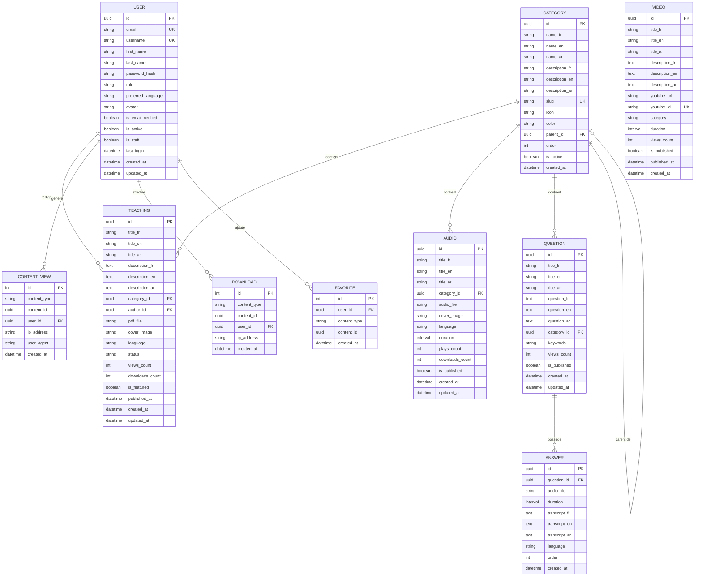

# 🗄 Base de données — Maktaba CATK

## Table des matières

- [Vue d'ensemble](#vue-densemble)
- [Diagramme ERD](#diagramme-erd)
- [Description des tables](#description-des-tables)
- [Conventions de nommage](#conventions-de-nommage)
- [Indexes et optimisations](#indexes-et-optimisations)
- [Migrations](#migrations)

---

## Vue d'ensemble

| Propriété | Valeur |
|-----------|--------|
| **SGBD** | PostgreSQL 16 |
| **ORM** | Django ORM |
| **UUID** | Clés primaires UUID v4 |
| **Timestamps** | `created_at`, `updated_at` sur toutes les tables |
| **Soft delete** | Via champ `status` (pas de DELETE réel) |
| **Multilangue** | Colonnes `_fr`, `_en`, `_ar` par champ texte |

---

## Diagramme ERD



---

## Description des tables

### `users_user`

Table principale des utilisateurs, étend `AbstractBaseUser` de Django.

| Colonne | Type | Contraintes | Description |
|---------|------|------------|-------------|
| `id` | UUID | PK, DEFAULT gen_random_uuid() | Identifiant unique |
| `email` | VARCHAR(254) | UNIQUE, NOT NULL | Email (login) |
| `username` | VARCHAR(150) | UNIQUE, NOT NULL | Pseudonyme |
| `first_name` | VARCHAR(150) | | Prénom |
| `last_name` | VARCHAR(150) | | Nom |
| `password` | VARCHAR(128) | NOT NULL | Hash PBKDF2-SHA256 |
| `role` | VARCHAR(20) | DEFAULT 'member' | `anonymous`, `member`, `editor`, `admin`, `superadmin` |
| `preferred_language` | VARCHAR(5) | DEFAULT 'fr' | `fr`, `en`, `ar` |
| `avatar` | VARCHAR(500) | NULL | Chemin MinIO |
| `is_email_verified` | BOOLEAN | DEFAULT FALSE | Vérification email |
| `is_active` | BOOLEAN | DEFAULT TRUE | Compte actif |
| `is_staff` | BOOLEAN | DEFAULT FALSE | Accès admin Django |
| `last_login` | TIMESTAMP | NULL | Dernière connexion |
| `created_at` | TIMESTAMP | DEFAULT NOW() | Date d'inscription |
| `updated_at` | TIMESTAMP | AUTO UPDATE | Dernière modification |

**Index :** `idx_user_email`, `idx_user_role`

---

### `categories_category`

Taxonomie hiérarchique des contenus.

| Colonne | Type | Contraintes | Description |
|---------|------|------------|-------------|
| `id` | UUID | PK | Identifiant unique |
| `name_fr` | VARCHAR(200) | NOT NULL | Nom en français |
| `name_en` | VARCHAR(200) | NOT NULL | Nom en anglais |
| `name_ar` | VARCHAR(200) | NOT NULL | Nom en arabe |
| `description_fr` | TEXT | NULL | Description FR |
| `description_en` | TEXT | NULL | Description EN |
| `description_ar` | TEXT | NULL | Description AR |
| `slug` | VARCHAR(200) | UNIQUE, NOT NULL | Identifiant URL |
| `icon` | VARCHAR(100) | NULL | Nom d'icône (Lucide) |
| `color` | VARCHAR(7) | NULL | Couleur hex (#1B5E20) |
| `parent_id` | UUID | FK → category.id, NULL | Catégorie parente |
| `order` | INTEGER | DEFAULT 0 | Ordre d'affichage |
| `is_active` | BOOLEAN | DEFAULT TRUE | Catégorie active |
| `created_at` | TIMESTAMP | DEFAULT NOW() | Date de création |

**Index :** `idx_category_slug`, `idx_category_parent`, `idx_category_active_order`

---

### `teachings_teaching`

Enseignements islamiques en format PDF.

| Colonne | Type | Contraintes | Description |
|---------|------|------------|-------------|
| `id` | UUID | PK | Identifiant unique |
| `title_fr` | VARCHAR(500) | NOT NULL | Titre en français |
| `title_en` | VARCHAR(500) | NOT NULL | Titre en anglais |
| `title_ar` | VARCHAR(500) | NOT NULL | Titre en arabe |
| `description_fr` | TEXT | NULL | Description FR |
| `description_en` | TEXT | NULL | Description EN |
| `description_ar` | TEXT | NULL | Description AR |
| `category_id` | UUID | FK → category.id | Catégorie |
| `author_id` | UUID | FK → user.id, NULL | Auteur/Rédacteur |
| `pdf_file` | VARCHAR(500) | NULL | Chemin MinIO du PDF |
| `cover_image` | VARCHAR(500) | NULL | Image de couverture |
| `language` | VARCHAR(5) | DEFAULT 'fr' | Langue principale |
| `status` | VARCHAR(20) | DEFAULT 'draft' | `draft`, `published`, `archived` |
| `views_count` | INTEGER | DEFAULT 0 | Nombre de vues |
| `downloads_count` | INTEGER | DEFAULT 0 | Nombre de téléchargements |
| `is_featured` | BOOLEAN | DEFAULT FALSE | Mis en avant |
| `published_at` | TIMESTAMP | NULL | Date de publication |
| `created_at` | TIMESTAMP | DEFAULT NOW() | Date de création |
| `updated_at` | TIMESTAMP | AUTO UPDATE | Dernière modification |

**Index :** `idx_teaching_status_published`, `idx_teaching_category_lang`, `idx_teaching_featured`

---

### `audios_audio`

Fichiers audio (conférences, dhikr, récitations).

| Colonne | Type | Contraintes | Description |
|---------|------|------------|-------------|
| `id` | UUID | PK | Identifiant unique |
| `title_fr` | VARCHAR(500) | NOT NULL | Titre FR |
| `title_en` | VARCHAR(500) | NOT NULL | Titre EN |
| `title_ar` | VARCHAR(500) | NOT NULL | Titre AR |
| `category_id` | UUID | FK → category.id | Catégorie |
| `audio_file` | VARCHAR(500) | NOT NULL | Chemin MinIO (MP3/WAV) |
| `cover_image` | VARCHAR(500) | NULL | Image de couverture |
| `language` | VARCHAR(5) | DEFAULT 'fr' | Langue |
| `duration` | INTERVAL | NULL | Durée (HH:MM:SS) |
| `plays_count` | INTEGER | DEFAULT 0 | Nombre de lectures |
| `downloads_count` | INTEGER | DEFAULT 0 | Nombre de téléchargements |
| `is_published` | BOOLEAN | DEFAULT FALSE | Publié |
| `created_at` | TIMESTAMP | DEFAULT NOW() | Date de création |
| `updated_at` | TIMESTAMP | AUTO UPDATE | Dernière modification |

---

### `videos_video`

Vidéos YouTube intégrées.

| Colonne | Type | Contraintes | Description |
|---------|------|------------|-------------|
| `id` | UUID | PK | Identifiant unique |
| `title_fr` | VARCHAR(500) | NOT NULL | Titre FR |
| `title_en` | VARCHAR(500) | NOT NULL | Titre EN |
| `title_ar` | VARCHAR(500) | NOT NULL | Titre AR |
| `description_fr` | TEXT | NULL | Description FR |
| `description_en` | TEXT | NULL | Description EN |
| `description_ar` | TEXT | NULL | Description AR |
| `youtube_url` | VARCHAR(500) | NOT NULL | URL YouTube complète |
| `youtube_id` | VARCHAR(20) | UNIQUE, NOT NULL | ID vidéo YouTube (ex: dQw4w9WgXcQ) |
| `category` | VARCHAR(100) | NULL | Catégorie textuelle |
| `duration` | INTERVAL | NULL | Durée de la vidéo |
| `views_count` | INTEGER | DEFAULT 0 | Vues |
| `is_published` | BOOLEAN | DEFAULT FALSE | Publié |
| `published_at` | TIMESTAMP | NULL | Date de publication |
| `created_at` | TIMESTAMP | DEFAULT NOW() | Date de création |

---

### `questions_question` + `questions_answer`

Questions fréquentes avec réponses audio.

**questions_question :**

| Colonne | Type | Description |
|---------|------|-------------|
| `id` | UUID PK | Identifiant |
| `title_fr/en/ar` | VARCHAR(500) | Titre de la question |
| `question_fr/en/ar` | TEXT | Corps de la question |
| `category_id` | UUID FK | Catégorie |
| `keywords` | TEXT | Tags séparés par virgule |
| `views_count` | INTEGER | Nombre de vues |
| `is_published` | BOOLEAN | Statut de publication |
| `created_at` | TIMESTAMP | Date de création |

**questions_answer :**

| Colonne | Type | Description |
|---------|------|-------------|
| `id` | UUID PK | Identifiant |
| `question_id` | UUID FK | Question parente |
| `audio_file` | VARCHAR(500) | Chemin MinIO |
| `duration` | INTERVAL | Durée audio |
| `transcript_fr/en/ar` | TEXT | Transcription texte |
| `language` | VARCHAR(5) | Langue principale |
| `order` | INTEGER | Ordre d'affichage |
| `created_at` | TIMESTAMP | Date de création |

---

### Tables de tracking

#### `stats_contentview`

| Colonne | Type | Description |
|---------|------|-------------|
| `id` | SERIAL PK | Auto-incrément |
| `content_type` | VARCHAR(20) | `teaching`, `audio`, `video`, `question` |
| `content_id` | UUID | ID du contenu consulté |
| `user_id` | UUID FK NULL | Utilisateur connecté |
| `ip_address` | INET | IP du visiteur |
| `user_agent` | TEXT | Navigateur/OS |
| `created_at` | TIMESTAMP | Horodatage |

#### `stats_download`

| Colonne | Type | Description |
|---------|------|-------------|
| `id` | SERIAL PK | Auto-incrément |
| `content_type` | VARCHAR(20) | `teaching`, `audio` |
| `content_id` | UUID | ID du contenu téléchargé |
| `user_id` | UUID FK NULL | Utilisateur connecté |
| `ip_address` | INET | IP |
| `created_at` | TIMESTAMP | Horodatage |

#### `users_favorite`

| Colonne | Type | Description |
|---------|------|-------------|
| `id` | SERIAL PK | Auto-incrément |
| `user_id` | UUID FK | Utilisateur |
| `content_type` | VARCHAR(20) | Type de contenu |
| `content_id` | UUID | ID du contenu |
| `created_at` | TIMESTAMP | Date d'ajout |

**Contrainte unique :** `(user_id, content_type, content_id)`

---

## Conventions de nommage

| Convention | Exemple |
|-----------|---------|
| Tables | `app_modelname` (Django convention) |
| Colonnes | `snake_case` |
| Clés primaires | `id` (UUID) |
| Clés étrangères | `{model}_id` |
| Champs multilingues | `{field}_fr`, `{field}_en`, `{field}_ar` |
| Timestamps | `created_at`, `updated_at` |
| Booléens | `is_active`, `is_featured`, `is_published` |
| Compteurs | `{action}_count` |

---

## Indexes et optimisations

```sql
-- Teachings
CREATE INDEX idx_teaching_status_pub ON teachings_teaching(status, published_at DESC);
CREATE INDEX idx_teaching_category   ON teachings_teaching(category_id, language);
CREATE INDEX idx_teaching_featured   ON teachings_teaching(is_featured, status);

-- Audios
CREATE INDEX idx_audio_category      ON audios_audio(category_id, is_published);

-- Questions
CREATE INDEX idx_question_category   ON questions_question(category_id, is_published);

-- Stats (haute volumétrie)
CREATE INDEX idx_view_content        ON stats_contentview(content_type, content_id);
CREATE INDEX idx_view_created        ON stats_contentview(created_at DESC);
CREATE INDEX idx_download_content    ON stats_download(content_type, content_id);

-- Favorites
CREATE UNIQUE INDEX idx_favorite_unique ON users_favorite(user_id, content_type, content_id);

-- Full-text search (PostgreSQL)
CREATE INDEX idx_teaching_search ON teachings_teaching
    USING GIN(to_tsvector('french', title_fr || ' ' || COALESCE(description_fr, '')));
```

---

## Migrations

```bash
# Créer une migration
docker compose exec backend python manage.py makemigrations

# Appliquer les migrations
docker compose exec backend python manage.py migrate

# Voir l'état des migrations
docker compose exec backend python manage.py showmigrations

# Rollback (revenir en arrière)
docker compose exec backend python manage.py migrate teachings 0002_previous_migration

# Migration de données (data migration)
docker compose exec backend python manage.py migrate --run-syncdb
```

### Ordre d'application des migrations

```
1. users/migrations/          (dépendances aucune)
2. categories/migrations/     (dépend: users)
3. teachings/migrations/      (dépend: users, categories)
4. audios/migrations/         (dépend: categories)
5. videos/migrations/         (dépend: aucune)
6. questions/migrations/      (dépend: categories)
7. stats/migrations/          (dépend: users)
```
