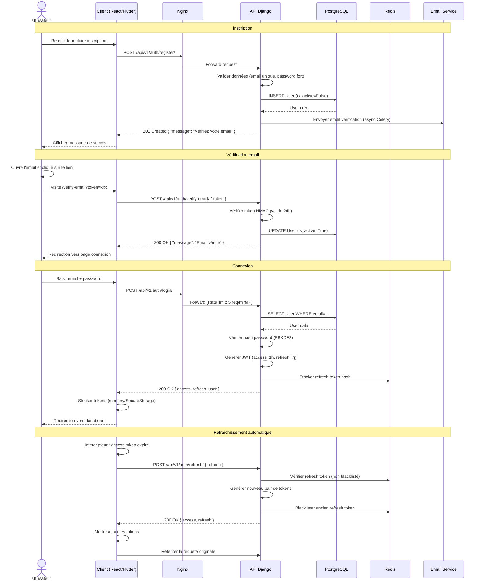
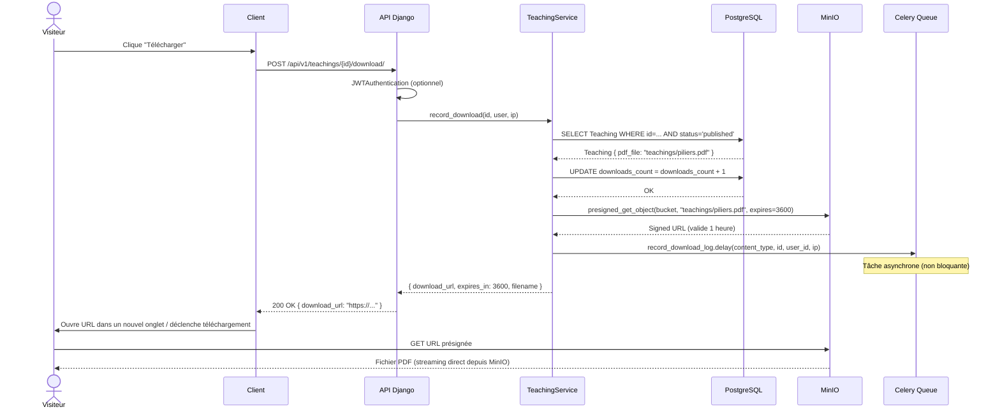
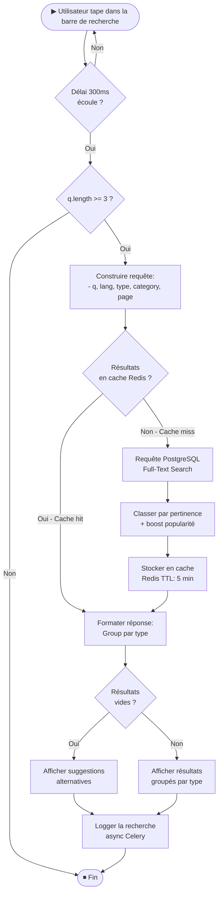
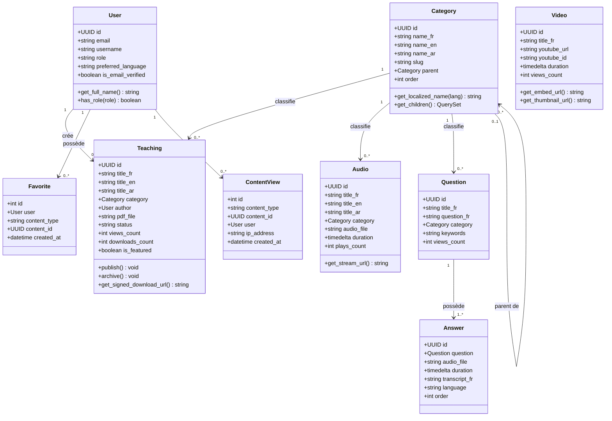
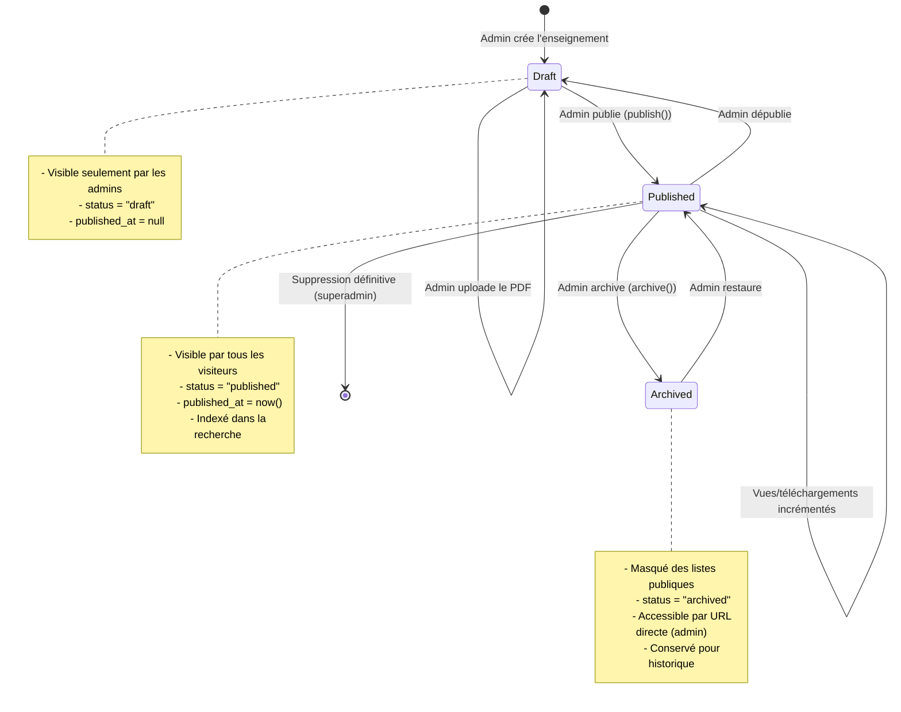

# 📊 Diagrammes UML — Maktaba CATK

## Table des matières

- [Diagramme de cas d'utilisation](#diagramme-de-cas-dutilisation)
- [Diagramme de séquence — Authentification](#diagramme-de-séquence--authentification)
- [Diagramme de séquence — Téléchargement PDF](#diagramme-de-séquence--téléchargement-pdf)
- [Diagramme d'activité — Recherche](#diagramme-dactivité--recherche)
- [Diagramme de classes simplifié](#diagramme-de-classes-simplifié)
- [Diagramme d'état — Enseignement](#diagramme-détat--enseignement)

---

## Diagramme de cas d'utilisation

```mermaid
graph TB
    %% Acteurs
    Visiteur([👤 Visiteur])
    Membre([👥 Membre])
    Editeur([✏️ Éditeur])
    Admin([🔧 Admin])
    SuperAdmin([👑 SuperAdmin])

    %% Héritage des acteurs
    Membre -->|étend| Visiteur
    Editeur -->|étend| Membre
    Admin -->|étend| Editeur
    SuperAdmin -->|étend| Admin

    %% Cas d'utilisation — Visiteur
    subgraph UC_PUBLIC ["🌐 Contenus publics"]
        UC1[Consulter les enseignements]
        UC2[Lire un PDF en ligne]
        UC3[Télécharger un PDF]
        UC4[Écouter un audio]
        UC5[Regarder une vidéo YouTube]
        UC6[Consulter les Q&R]
        UC7[Écouter la réponse audio]
        UC8[Lire la transcription]
        UC9[Rechercher du contenu]
        UC10[Parcourir les catégories]
        UC11[Changer la langue FR/EN/AR]
    end

    %% Cas d'utilisation — Membre
    subgraph UC_MEMBRE ["🔐 Fonctionnalités membres"]
        UC20[S'inscrire]
        UC21[Se connecter]
        UC22[Vérifier son email]
        UC23[Réinitialiser son mot de passe]
        UC24[Gérer son profil]
        UC25[Ajouter aux favoris]
        UC26[Voir ses favoris]
        UC27[Voir son historique]
        UC28[Se connecter via Google]
    end

    %% Cas d'utilisation — Admin
    subgraph UC_ADMIN ["⚙️ Administration"]
        UC40[Créer un enseignement]
        UC41[Modifier un enseignement]
        UC42[Publier/Archiver un enseignement]
        UC43[Uploader un PDF]
        UC44[Gérer les audios]
        UC45[Gérer les vidéos YouTube]
        UC46[Gérer les Q&R]
        UC47[Uploader une réponse audio]
        UC48[Voir les statistiques dashboard]
        UC49[Gérer les catégories]
    end

    %% Cas d'utilisation — SuperAdmin
    subgraph UC_SUPERADMIN ["👑 Super Administration"]
        UC60[Gérer les utilisateurs]
        UC61[Modifier les rôles]
        UC62[Suspendre/Réactiver un compte]
        UC63[Voir les logs d'audit]
    end

    %% Associations Visiteur
    Visiteur --- UC1
    Visiteur --- UC2
    Visiteur --- UC3
    Visiteur --- UC4
    Visiteur --- UC5
    Visiteur --- UC6
    Visiteur --- UC7
    Visiteur --- UC8
    Visiteur --- UC9
    Visiteur --- UC10
    Visiteur --- UC11
    Visiteur --- UC20
    Visiteur --- UC21
    Visiteur --- UC28

    %% Associations Membre (en plus de Visiteur)
    Membre --- UC22
    Membre --- UC23
    Membre --- UC24
    Membre --- UC25
    Membre --- UC26
    Membre --- UC27

    %% Associations Admin
    Admin --- UC40
    Admin --- UC41
    Admin --- UC42
    Admin --- UC43
    Admin --- UC44
    Admin --- UC45
    Admin --- UC46
    Admin --- UC47
    Admin --- UC48
    Admin --- UC49

    %% Associations SuperAdmin
    SuperAdmin --- UC60
    SuperAdmin --- UC61
    SuperAdmin --- UC62
    SuperAdmin --- UC63

    %% Style
    style Visiteur fill:#E3F2FD,stroke:#1565C0
    style Membre fill:#E8F5E9,stroke:#2E7D32
    style Editeur fill:#FFF3E0,stroke:#E65100
    style Admin fill:#FCE4EC,stroke:#880E4F
    style SuperAdmin fill:#EDE7F6,stroke:#4527A0
```

---

## Diagramme de séquence — Authentification

---

## Diagramme de séquence — Téléchargement PDF

---

## Diagramme d'activité — Recherche

---

## Diagramme de classes simplifié

---

## Diagramme d'état — Enseignement

